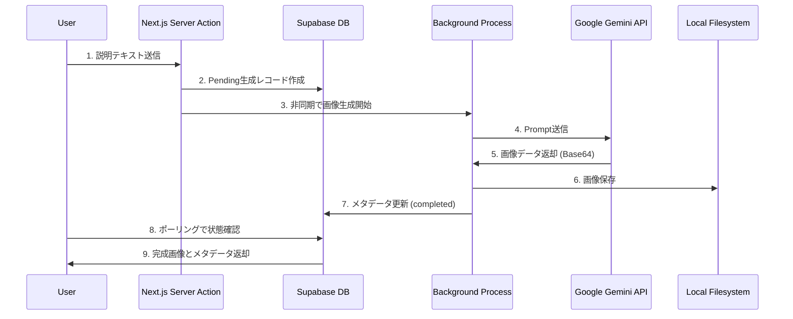

# 🎨 Visual Echo

**Visual Echo**は、生成AIを活用した非同期・分岐型の画像連想ゲームです。

画像を言葉で表現し、AIがその言葉から新しい画像を生成。この連鎖によって、当初の意図から離れていく（あるいは奇跡的に維持される）視覚的な変遷を楽しむことができます。

[](https://nextjs.org/)
[](https://www.typescriptlang.org/)
[](https://supabase.com/)
[](https://ai.google.dev/)

## ✨ 特徴

- 🌳 **ツリー構造**: Gitのブランチのように、1つの画像から複数の解釈が分岐
- 🔄 **非同期処理**: リアルタイム性を必要とせず、自分のペースでプレイ可能
- 🎯 **視覚化**: インタラクティブなツリービューで全体の連鎖を俯瞰
- 🎨 **AI生成**: Google Gemini 2.5 Flash Imageによる高品質な画像生成
- 📊 **系譜追跡**: 画像の誕生から現在まで、すべての変遷を追跡可能

## 🖼️ スクリーンショット

### ギャラリービュー
ランダムに選ばれた3枚の画像を表示。各画像から新しい連鎖を開始できます。

### ツリービュー
すべての画像の連鎖を木構造で可視化。ズーム・パン操作に対応。

### 画像詳細
画像の系譜（ルートから現在まで）を視覚的に表示し、新しい解釈を追加できます。

## 🛠 技術スタック

| カテゴリ | 技術 | 用途 |
|---------|------|------|
| Frontend | Next.js 15 (App Router) | React 19ベースのフルスタックフレームワーク |
| Language | TypeScript 5 | 型安全な開発環境 |
| Database | Supabase (PostgreSQL) | リアルタイムデータベース |
| AI Model | Google Gemini 2.5 Flash Image | Text-to-Image生成 |
| Styling | Tailwind CSS | ユーティリティファーストCSS |
| Storage | Local Filesystem | 生成画像の保存 (`public/images/generated/`) |

## 📐 アーキテクチャ

### データフロー



### データベース設計

**generations テーブル** - 自己参照によるツリー構造（Adjacency List パターン）

| カラム名 | 型 | 説明 |
|---------|-----|------|
| `id` | UUID | 主キー（自動生成） |
| `parent_id` | UUID | 親画像のID（ルートの場合はNULL） |
| `image_url` | TEXT | 生成画像のローカルパス |
| `prompt` | TEXT | ユーザー入力の説明文 |
| `created_at` | TIMESTAMPTZ | 作成日時 |
| `status` | generation_status | 生成ステータス（pending/completed/failed） |

**RPC関数**: `get_tree_structure(root_id UUID)` - 再帰的CTEによる効率的なツリー取得

## 🚀 セットアップ

### 前提条件

- Node.js 18以上
- Supabaseアカウント
- Google Gemini APIキー

### インストール手順

1. **リポジトリのクローン**

```bash
git clone https://github.com/kwrkb/visual-echo.git
cd visual-echo
```

2. **依存関係のインストール**

```bash
npm install
```

3. **環境変数の設定**

```bash
cp .env.local.example .env.local
```

`.env.local`を編集して、以下を設定:

```bash
# Supabase設定（Project Settings → API から取得）
NEXT_PUBLIC_SUPABASE_URL=your-project-url.supabase.co
NEXT_PUBLIC_SUPABASE_ANON_KEY=your-anon-key

# Google Gemini API設定（https://makersuite.google.com/app/apikey から取得）
GEMINI_API_KEY=your-gemini-api-key

# オプション: モデル指定（デフォルト: gemini-2.5-flash-image）
GEMINI_MODEL=gemini-2.5-flash-image
```

4. **データベースのセットアップ**

Supabase DashboardのSQL Editorで以下を順番に実行:

```sql
-- 1. スキーマとテーブル作成
-- supabase/schema.sql の内容を実行

-- 2. RPC関数作成（既存DBの場合は以下のマイグレーションを実行）
-- supabase/migrations/add_generation_status_enum.sql
-- supabase/migrations/update_tree_rpc_enum.sql
```

新規セットアップの場合は`supabase/schema.sql`のみでOKです。

5. **開発サーバーの起動**

```bash
npm run dev
```

http://localhost:3000 でアプリケーションが起動します。

## 📱 使い方

### 1. ギャラリーで画像を選ぶ
`/gallery` にアクセスして、ランダムに表示される3枚の画像から好きなものを選択。

### 2. 画像を言葉で説明
選択した画像を見て、その内容を自分の言葉で説明します。

### 3. AIが新しい画像を生成
あなたの説明をもとに、AIが新しい画像を生成します（約10〜30秒）。

### 4. 連鎖を確認
生成された画像と元の画像を比較。系譜ビューで、ルートからの変遷を確認できます。

### 5. ツリービューで全体を俯瞰
`/tree` にアクセスして、すべての画像の連鎖をインタラクティブなツリーで探索。

## 🎯 主要機能

### ギャラリー (`/gallery`)
- ランダムに3枚の画像を表示
- 「全て表示」ボタンで全画像一覧に遷移

### ツリービュー (`/tree`)
- 全画像の連鎖を木構造で可視化
- ズーム・パン操作に対応
- 各ノードをクリックして詳細へ遷移

### 画像詳細 (`/gallery/[id]`)
- 画像の系譜（ルートから現在まで）を表示
- プロンプト入力フォームで新しい分岐を作成
- 子画像一覧を表示

### 新規作成 (`/create`)
- ルート画像（ツリーの起点）を生成

## 🔧 開発コマンド

```bash
# 開発サーバー起動
npm run dev

# 本番ビルド
npm run build

# 本番サーバー起動
npm start

# Lintチェック
npm run lint
```

## 📊 プロジェクト構成

```
visual-echo/
├── app/                      # Next.js App Router
│   ├── actions/             # Server Actions
│   ├── gallery/             # ギャラリーページ群
│   ├── tree/                # ツリービュー
│   └── create/              # 新規作成ページ
├── components/              # Reactコンポーネント
├── lib/                     # ライブラリ・ユーティリティ
│   ├── supabase/           # Supabaseクライアント
│   ├── gemini/             # Gemini APIクライアント
│   └── queries/            # データベースクエリ
├── types/                   # TypeScript型定義
├── supabase/               # データベース関連
│   ├── schema.sql          # スキーマ定義
│   └── migrations/         # マイグレーションスクリプト
└── public/                 # 静的ファイル
    └── images/
        └── generated/      # AI生成画像（gitignore対象）
```

## ⚠️ 注意事項

### ローカル環境での動作を想定
本アプリケーションは生成された画像をローカルファイルシステムに保存します。本番環境にデプロイする場合は、Supabase StorageやCloudinaryなどのクラウドストレージへの移行が必要です。

### API利用料金
Google Gemini APIの使用により料金が発生する可能性があります。詳細は[Gemini API Pricing](https://ai.google.dev/pricing)をご確認ください。

### データベースポリシー
開発用に全ユーザーが読み書き可能なRLSポリシーが設定されています。本番環境では適切な認証・認可ポリシーを設定してください。

## 📝 ライセンス

MIT License

## 🤝 コントリビューション

Issue・Pull Requestを歓迎します！

## 📮 お問い合わせ

質問や提案がある場合は、[Issues](https://github.com/kwrkb/visual-echo/issues)でお知らせください。

---

**Made with ❤️ using Next.js, Supabase, and Google Gemini AI**
